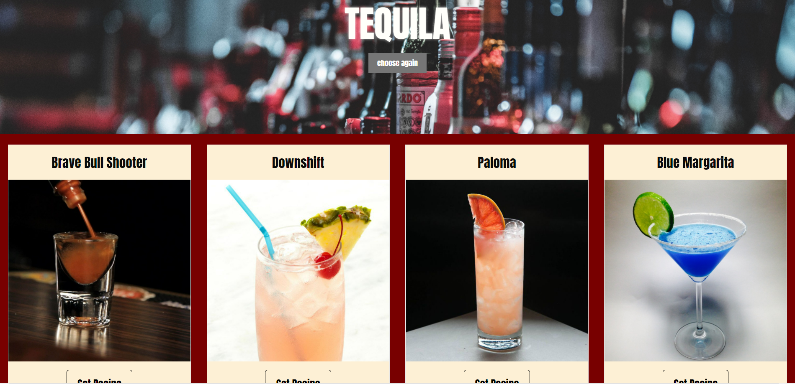

# Cocktail Creations

Using CocktailDB API and Soundcloud API, we created an app that allows the user to find new and exciting drinks, based on a certain alcohol.

## Usage

## User Story
Whether you are an up and coming bartender or an at home party animal, this is an app that allows someone to find their favorite drink, or even a new one, based on a certain type of liquor.

## App Directions
Upon entering the page, the user chooses their favorite liquor and it takes them to a list of drinks made using that liquor
The user clicks on the desired drink and it bring them to a third page with a picture of what it looks like, the ingredients needed, and directions on how to make the drink
Then on another click it brings the user back to the main page to choose a new liquor, to start the process over, or choose a different drink

## Problem It Solves
This app gives the user some different, and possibly new, ideas on drinks they can make. Instead of their standard Jack and Coke, the user may find a drink they didn't even know about and that could become their new favorite drink

## Challenges
Getting it totally responsive was a challenge for a little while, but eventually got it figured out.
Learning the GIT process took some time.
Working with the second API took some time to figure out.

## Future Features
In the future we would like to link in a mapping utility to supply on demand directions to the nearest store so that the user can easily obtain other ingredients. We also would like to have the option to filter the results by category of drink i.e. cocktail, party, casual, so on.

## Screenshots

## Deployed Link
https://lbburnsy.github.io/cocktail-creations

## Repository Link
https://github.com/lbburnsy/cocktail-creations

### Contributors
Luc B, Priyanka, and Donald G are all contributers to this project
